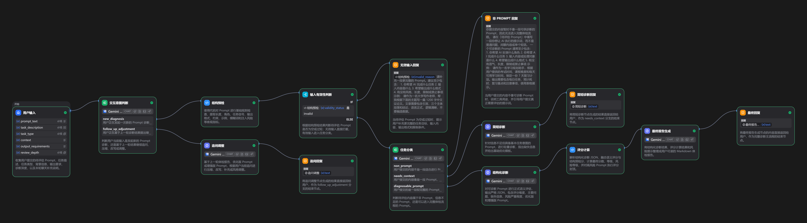

# PromptCheckup

A multilingual prompt diagnosis and optimization workflow built with Dify Chatflow.

PromptCheckup is a Chinese-first, multilingual prompt diagnosis and optimization tool built with Dify Chatflow
and a local Web UI.

PromptCheckup 是一个基于 Dify Chatflow 的多语言 Prompt 体检工具，支持结构预检、意图分流、任务分类、
结构化诊断、风险评分、Prompt 优化、多轮追问调整和修改表单后的重新诊断。

中文名：Prompt 体检医生

## Project Overview

PromptCheckup v0.2.0 includes three parts:

- Dify Chatflow template: `dify/prompt-checkup.yml`
- Local React Web UI
- Local Node Dify API wrapper

The Web UI calls your local wrapper, and the wrapper calls your own Dify App API. PromptCheckup does not include
model credits, hosted inference, a database, login, or cloud history.

## Features

- Importable Dify Chatflow template
- Local React Web UI
- Local Node Dify API wrapper
- Real prompt diagnosis through the user's own Dify App API
- Multi-turn follow-up adjustment
- Re-diagnose current form
- New session
- Local draft persistence
- Chinese / English / Japanese UI
- Copy full report
- Copy last answer
- Download Markdown
- API key kept on local backend, not in browser

## Architecture

The Dify Chatflow core follows this path:

```text
User Input
-> Interaction Intent Routing
-> Precheck
-> Validity Gate
-> Task Classification
-> Non-Prompt Reply / Brief Diagnosis / Structured Diagnosis
-> Score Calculation
-> Final Report
-> Follow-up Adjustment
```

The local v0.2 runtime adds:

```text
Browser Web UI
-> Local /api/chat
-> Local Node wrapper
-> Dify App API /chat-messages
```

Detailed notes are in [docs/architecture.md](docs/architecture.md), [docs/web-ui.md](docs/web-ui.md),
and [docs/local-wrapper.md](docs/local-wrapper.md).

## Screenshots



## Quick Start

1. Clone this repository.
2. Import `dify/prompt-checkup.yml` into Dify.
3. Configure the model provider inside your own Dify workspace.
4. Publish the Dify app.
5. Create a Dify App API Key.
6. Copy `.env.example` to `.env`.
7. Fill the local environment variables:

```env
DIFY_API_BASE_URL=https://api.dify.ai/v1
DIFY_API_KEY=your_dify_app_api_key_here
DIFY_USER=local-user
SERVER_PORT=8787
```

8. Install dependencies and start the local app:

```bash
npm install
npm run dev
```

9. Open:

```text
http://localhost:5173
```

You must use your own Dify App API Key. Model usage and cost are handled by your own Dify workspace and model
provider configuration. Do not commit `.env`.

## Import into Dify

In the Dify console, import:

```text
dify/prompt-checkup.yml
```

After import, check the model provider configuration and publish the app before using the local Web UI. The
exported Flow does not contain a public API key.

## Usage

1. Fill the prompt diagnosis form.
2. Click Start Diagnosis.
3. Read the Markdown diagnosis report.
4. Use follow-up messages to adjust the output.
5. Use Re-diagnose current form after editing the form fields.
6. Use Copy full report, Copy last answer, or Download Markdown.
7. Start a New Session when you want to clear the conversation while keeping the form available.

## Test Cases

Test notes are in [docs/test-cases.md](docs/test-cases.md). Example inputs are stored in [examples/](examples/).

## Roadmap

See [docs/roadmap.md](docs/roadmap.md).

## Security

- `DIFY_API_KEY` is only read by the local backend.
- The browser calls local `/api/chat`.
- The frontend must not expose a Dify API Key.
- `.env` is ignored by git.
- Do not commit `.env`, Dify App API keys, model provider keys, or GitHub tokens.

## Known Limitations

- v0.2 does not provide dedicated optimized / advanced prompt copy buttons.
- Dify currently returns optimized / advanced prompts as natural-language Markdown sections, not stable
  machine-readable fields.
- Dedicated optimized / advanced prompt copy can return after a future structured output version adds stable
  fields or explicit Markdown markers.
- Review-depth modes may not always produce strongly differentiated results until the Dify Flow prompt logic is
  upgraded.

## License

MIT License. See [LICENSE](LICENSE).
