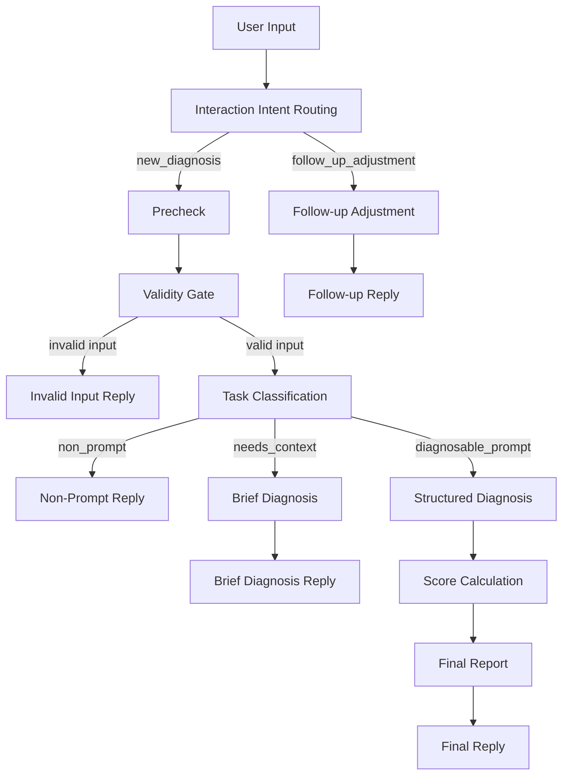

# Architecture

PromptCheckup v0.1 is implemented as a Dify Chatflow.
The exported DSL is stored at `dify/prompt-checkup.yml`.

```text
User Input
-> Interaction Intent Routing
-> Precheck
-> Validity Gate
-> Task Classification
-> Non-Prompt Reply / Brief Diagnosis / Structured Diagnosis
-> Score Calculation
-> Final Report
-> Follow-up Adjustment
```

## Flow Overview



The diagram is intentionally simple so the architecture remains readable even when Mermaid rendering is unavailable.

## Core Branches

### invalid input

The precheck and validity gate catch empty or extremely short input before it reaches LLM-based diagnosis.
This branch returns a direct message asking the user to provide a clearer task goal, input content,
output format, and constraints.

### non_prompt

The task classifier sends ordinary chat, purchase advice, vague text, or content without a prompt-like task intent
into `non_prompt`.
This branch explains that the tool is for prompt diagnosis and asks the user to submit an actual prompt.

### needs_context

The `needs_context` branch handles input that looks like a prompt but lacks key information such as task background,
target audience, input source, output format, constraints, or evaluation criteria.
It produces a brief diagnosis without a full score.

### diagnosable_prompt

The `diagnosable_prompt` branch runs the full diagnostic path.
It performs structured JSON diagnosis, calculates the final score, applies risk caps when needed,
and generates the final Markdown report.

### follow_up_adjustment

The interaction intent router detects when the user is asking to revise the previous optimized or enhanced prompt.
This branch adjusts the previous result without rerunning the full diagnosis or changing the score.

### changed form and re-diagnosis

When the user explicitly says that the form has changed and asks to re-diagnose,
the request should be treated as a new diagnosis.
The flow then uses the updated form fields and returns to the full diagnostic path when the prompt is diagnosable.

## Runtime Assumptions

- Users import the DSL into Dify and configure their own model provider.
- The workflow depends on Dify-managed model calls and code nodes.
- v0.1 does not include a web UI, local backend, database, user accounts, history, or marketplace automation.
